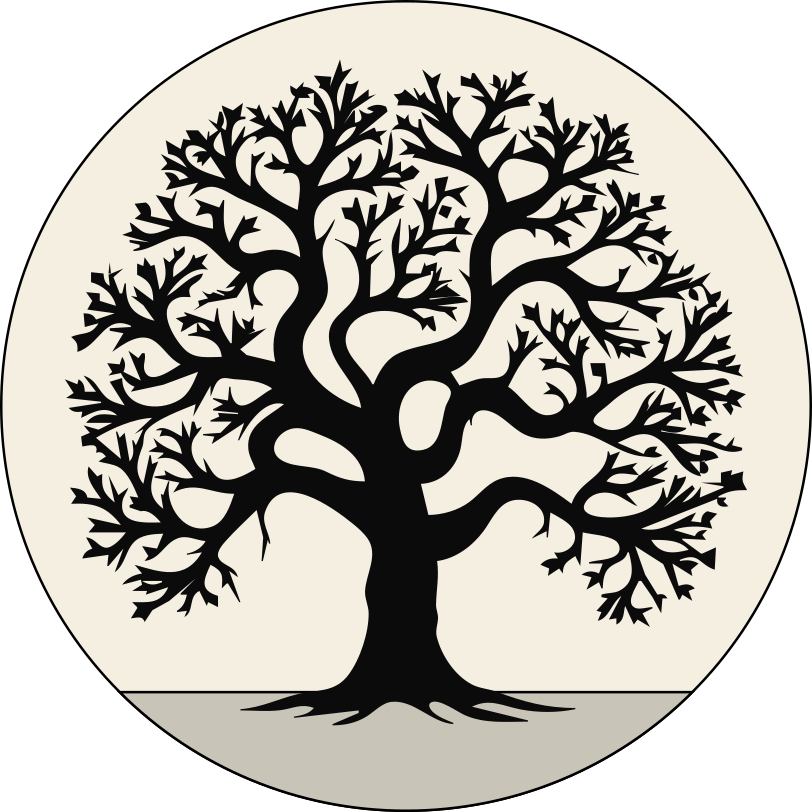

# Simposio — Pensamiento evolutivo en la psicología

<p align="center">
  
</p>

Presentación en Quarto revealjs. Incluye la apertura del simposio (breve) y
la charla "Evolución y discursos discriminatorios".

## Ver las presentaciones

- **Apertura del simposio:** https://jdleongomez.github.io/simposio-evolucion-discriminacion/apertura.html
- **Charla — Evolución y discursos discriminatorios:** https://jdleongomez.github.io/simposio-evolucion-discriminacion

## Estructura

```bash
.
├── index.qmd # la charla principal
├── apertura.qmd # apertura y programa del simposio
├── theme/
│ └── poster.scss # tema revealjs con la paleta del póster
├── img/
│ ├── simposio/ # logos institucionales, recorte del póster
│ └── charla/ # imágenes de la charla
├── references.bib # citas (Turkheimer 2000, Polderman et al. 2015, etc.)
├── title-slide.html # plantilla de la diapositiva de título
└── README.md
```

## Autor

Juan David Leongómez, PhD, MSc
Universidad El Bosque · [ORCID](https://orcid.org/0000-0002-0092-6298)
