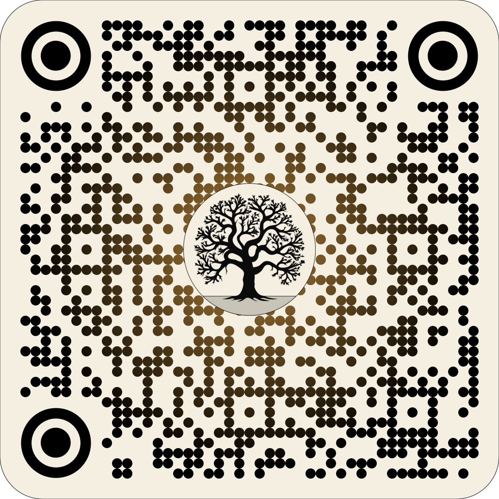

<!-- ======================================================= -->
<!-- 0. APERTURA DEL SIMPOSIO (2-3 min, fuera de tus 20 min)  -->
<!-- La portada de arriba (title-slide) SÍ se genera automática, -->
<!-- pero ahora con los 7 presentadores como autores, no solo tú. -->
<!-- Fondo: el póster a baja opacidad, como marca de agua. -->
<!-- ======================================================= -->

```{r}
#| echo: false
#| message: false

# Paquetes
library(tidyverse)
library(gt)

# Datos del programa. Ajusta las rutas de Foto cuando tengas los recortes
# de cada presentador (puedo ayudarte a recortarlos del póster si quieres).
df <- tribble(
  ~Nombre,                    ~Título,                                                                               ~Foto,
  "Juan David Leongómez",     "Evolución y discursos discriminatorios",                                              "img/simposio/speakers/juan.jpg",
  "Diego Otálora-Morales",    "Psicología evolutiva: implicaciones en la psicología clínica",                        "img/simposio/speakers/diego.jpg",
  "Andrés Felipe Reyes",      "Diferencias de sexo en la percepción del lenguaje y comunicación de parejas",         "img/simposio/speakers/andres.jpg",
  "Miguel Puentes-Escamilla", "Una mirada evolutiva a las estructuras sociales humanas",                             "img/simposio/speakers/miguel.jpg",
  "Valentina Cepeda",         "La manipulación evolutiva del sexo",                                                  "img/simposio/speakers/valentina.jpg",
  "Marcela Puentes",          "¿Por qué no podemos dejar de mirar? Atención visual, atractivo y dominancia facial",  "img/simposio/speakers/marcela.jpg",
  "Oscar R. Sánchez",         "Presentación del libro \"Evolución, comportamiento estratégico humano y desajuste\"", "img/simposio/speakers/oscar.jpg"
)

# Tabla gt del programa
tab_simposio <-
  df |>
  select(Foto, Nombre, Título) |>
  gt() |>
  # Convertir la columna 'Foto' en imagen local
  # (si falta el archivo, deja la celda vacía y avisa, en vez de tumbar el
  # render; así puedes ir completando fotos de a poco sin que se rompa todo)
  text_transform(
    locations = cells_body(columns = Foto),
    fn = function(x) {
      lapply(x, function(path) {
        if (!file.exists(path)) {
          warning(sprintf("No se encontró la imagen: %s", path))
          return("")
        }
        local_image(filename = path, height = 50)
      })
    }
  ) |>
  # Sin encabezados
  tab_options(
    column_labels.hidden = TRUE,
    table.font.names = c("Fira Sans", "Inter", "Helvetica", "Arial", "sans-serif"),
    data_row.padding = px(6),
    table.width = pct(85)
  ) |>
  # Anchos y alineación
  cols_width(
    Foto   ~ px(50),
    Nombre ~ px(160),
    Título ~ px(650)
  ) |>
  cols_align(
    columns = c(Nombre, Título),
    align = "left"
  ) |>
  # Estética compacta
  opt_row_striping() |>
  tab_style(
    style = cell_text(size = px(16)),
    locations = cells_body()
  ) |>
  tab_style(
    style = cell_text(weight = "bold"),
    locations = cells_body(columns = Título)
  ) |>
  # Resalta la fila de Oscar (cierre del simposio con la presentación del
  # libro), igual que la franja oscura del póster para el ítem 7.
  tab_style(
    style = list(
      cell_fill(color = "#333333"),
      cell_text(color = "white")
    ),
    locations = cells_body(rows = Nombre == "Oscar R. Sánchez")
  )

tab_simposio
```

---

<!-- ======================================================= -->
<!-- 1. TU CHARLA: "Evolución y discursos discriminatorios"  -->
<!-- Tiempo total objetivo: ~20 min                          -->
<!-- Portada de tu charla, siguiendo el mismo espíritu que la -->
<!-- de 2025: frase-gancho, nombre, afiliación, logos, evento -->
<!-- y fecha. El auto-animate hace que el título "vuele" hacia -->
<!-- la siguiente diapositiva de contenido.                   -->
<!-- ======================================================= -->

## Evolución y discursos discriminatorios {background-image="img/charla/fondo.png" background-size="cover" background-opacity="0.4" auto-animate="true"}

:::{.columns}
::: {.column width="60%"}
<div style="text-align:center; margin-top:0.5rem;">
  <p style="font-size:1.15rem; margin-top:0.2rem; margin-bottom:0.9rem;">
    <em>Explicar un fenómeno no es justificarlo: la ciencia evolutiva bien hecha es la mejor herramienta contra su propio mal uso.</em>
  </p>

  <p style="margin:0; font-size:1.05rem;">
    <strong>Juan David Leongómez</strong>
  </p>

  <p style="margin:0.2rem 0 0.8rem 0; font-size:1.05rem;">
    EvoCo, Universidad El Bosque
  </p>

  

  <p style="font-size:0.95rem; opacity:0.9; margin-top:0.2rem;">
    Simposio <em>Pensamiento evolutivo en la psicología</em><br>
    Universidad El Bosque · 26 de agosto de 2026
  </p>
</div>
:::

::: {.column width="40%"}
<div style="text-align:center;">
  <!-- Si vas a publicar el repo/slides, agrega aquí tu QR, como en 2025 -->
  <!-- {width="80%" fig-align="center"} -->
</div>
:::
:::

---

## Evolución y discursos discriminatorios {auto-animate="true"}

<!--
Esta es ya la primera diapositiva de contenido real (el auto-animate conecta
visualmente con la portada anterior). A partir de aquí sigue la estructura
que ya habíamos cerrado:
-->

<!-- ------------------------------------------------------- -->
<!-- 1.1 Motivación (2-3 min) -->
<!-- ------------------------------------------------------- -->

## Un mundo que retrocede

<!--
Contexto actual: giro a la derecha, redes sociales, manósfera, culto a la
testosterona/masculinidad. Ideal: 1-2 imágenes fuertes (portadas de prensa,
capturas, no memes gratuitos) más que texto.
-->

## La grieta

<!--
Tesis central:
- La base evolutiva del comportamiento humano es innegable.
- Eso ha abierto una grieta con la psicología y otras ciencias sociales:
  se asume que lo evolutivo es sinónimo de discriminatorio/reduccionista.
- Postura: la crítica está justificada (el campo sí ha caído en esto),
  pero la buena ciencia evolutiva es también la herramienta para combatirlo.
-->

<!-- ------------------------------------------------------- -->
<!-- 1.2 Puentes entre niveles de explicación + falacia      -->
<!--     naturalista (5-6 min)                               -->
<!-- ------------------------------------------------------- -->

## ¿Por qué los hombres son, en promedio, más propensos a la violencia física?

<!-- Diapositiva de planteamiento, sin responder aún. Imagen/ilustración simple. -->

## Dos explicaciones, dos niveles

::: {.columns}
::: {.column width="50%"}
**Explicación social (nivel próximo)**

<!--
Socialización, normas de masculinidad, refuerzo cultural de la
dominancia, estructuras patriarcales.
-->
:::
::: {.column width="50%"}
**Explicación evolutiva (nivel último)**

<!--
Competencia por estatus/pareja en la historia evolutiva humana,
consecuencias reproductivas de la disposición al riesgo.
-->
:::
:::

Ambas pueden ser ciertas **al mismo tiempo**: responden preguntas distintas.

## Error 1 — Exclusión

<!--
Tratar las dos explicaciones como rivales en vez de complementarias.
Esto es lo que ha alejado a la psicología evolutiva de otras ciencias
sociales.
-->

## Error 2 — Falacia naturalista

<!--
Asumir que, aun siendo cierta la explicación evolutiva, eso la vuelve
un "deber ser" inmodificable. Explicar el origen no es dictar el destino.
La cultura puede modificar lo que la evolución hizo posible (la historia
lo demuestra).
-->

## Nature vs. nurture: un falso dilema

<!--
Cierre del bloque con evidencia dura:
- Heredabilidad moderada (nunca 0%, nunca 100%) en casi todo rasgo
  conductual [@polderman2015]
- Interacción genotipo-ambiente
- [@turkheimer2000]

Idea para diagrama: espectro/doble flecha genes <-> ambiente, con la
cifra de heredabilidad agregada de Polderman et al. como dato ancla.
-->

<!-- ------------------------------------------------------- -->
<!-- 1.3 Recorrido por los ámbitos de apropiación indebida    -->
<!--     (6-8 min, rápido, casi solo evidencia + imágenes)    -->
<!-- ------------------------------------------------------- -->

## Racismo

<!-- "Ciencia" de raza e IQ, resurgimiento de la eugenesia [@sear2021eugenics] -->

## Sexismo y culto a la masculinidad

<!-- Manósfera, incels, énfasis en testosterona [@archer2006; @conroybeam2024] -->

## La "familia tradicional"

<!-- Mito del hombre cazador-proveedor / mujer cuidadora [@sear2021family] -->

## Sexo vs. género

<!-- Constructos multidimensionales, no reducibles a lo binario -->

<!-- ------------------------------------------------------- -->
<!-- 1.4 Contrapeso: la buena ciencia evolutiva (3-4 min)     -->
<!-- ------------------------------------------------------- -->

## Aportes con evidencia sólida

<!--
Apego, percepción de rostros/voces/señales sociales, lenguaje,
variabilidad transcultural. Reutiliza imágenes de la charla 2025
(img/charla/).
-->

## La integración es la que desmonta el determinismo

<!-- Antropología, sociología, historia + evolución, no evolución sola -->

<!-- ------------------------------------------------------- -->
<!-- 1.5 Cierre (1-2 min) -->
<!-- ------------------------------------------------------- -->

## El punto no es rechazar, ni tragar entero

<!--
Mensaje central: comprender la evolución no es justificar la
desigualdad. Ojo crítico para (1) no rechazar aportes fundamentales
y (2) no aceptar interpretaciones amañadas.
Conexión hacia las siguientes 6 presentaciones.
-->

## ¡Gracias! {background-image="img/charla/fondo.png" background-size="cover" background-opacity="0.4"}

**Juan David Leongómez** PhD, MSc
EvoCo · Universidad El Bosque
<jleongomez@unbosque.edu.co>

## Referencias {.smaller}

::: {#refs}
:::
