## Evolución y discursos discriminatorios {data-id="charla-title" auto-animate="true" autoslide="1000"}

---

## Evolución y discursos discriminatorios {data-id="charla-title" auto-animate="true"}

Las perspectivas evolutivas son [reduccionistas]{.highlight}.

---

## Evolución y discursos discriminatorios {data-id="charla-title" auto-animate="true"}

Las perspectivas evolutivas son [reduccionistas]{.highlight}.

Determinismo biológico

---

## Un mundo que retrocede

::: {.columns}

::: {.column width="42.5%"}
{.lightbox}

::: {.center-text}
**Racismo**
:::
:::

::: {.column width="57.5%"}
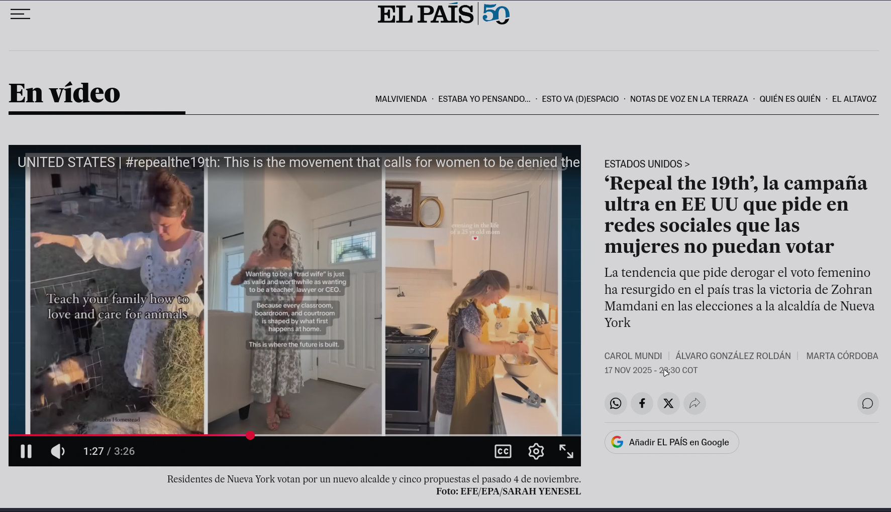{.lightbox}

::: {.center-text}
**Retroceso de derechos**
:::
:::

:::

::: {.credit}
Fuentes: [news.un.org (2025)](https://news.un.org/es/story/2025/11/1540765) · [elpais.com (2025)](https://elpais.com/videos/2025-11-18/repeal-the-19th-la-campana-ultra-en-ee-uu-que-pide-en-redes-sociales-que-las-mujeres-no-puedan-votar.html)
:::

---

## La psicología evolutiva en el centro {auto-animate="true"}

::: {.columns}

::: {.column width="33.3%"}
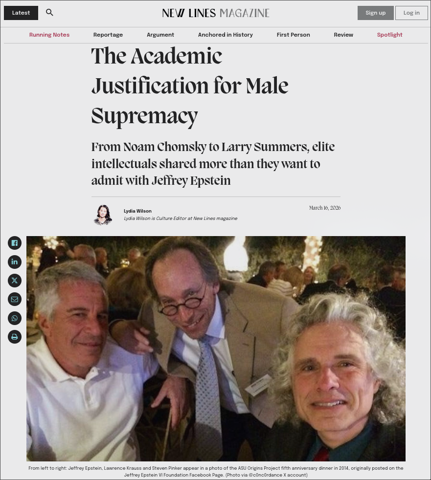{.fragment .emphasize-image .lightbox}
:::

::: {.column width="33.3%"}
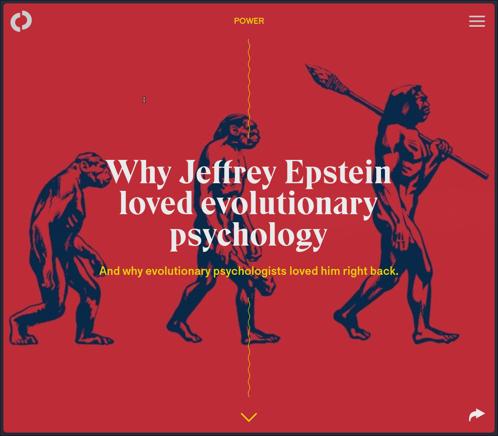{.fragment .emphasize-image .lightbox}
:::

::: {.column width="33.3%"}
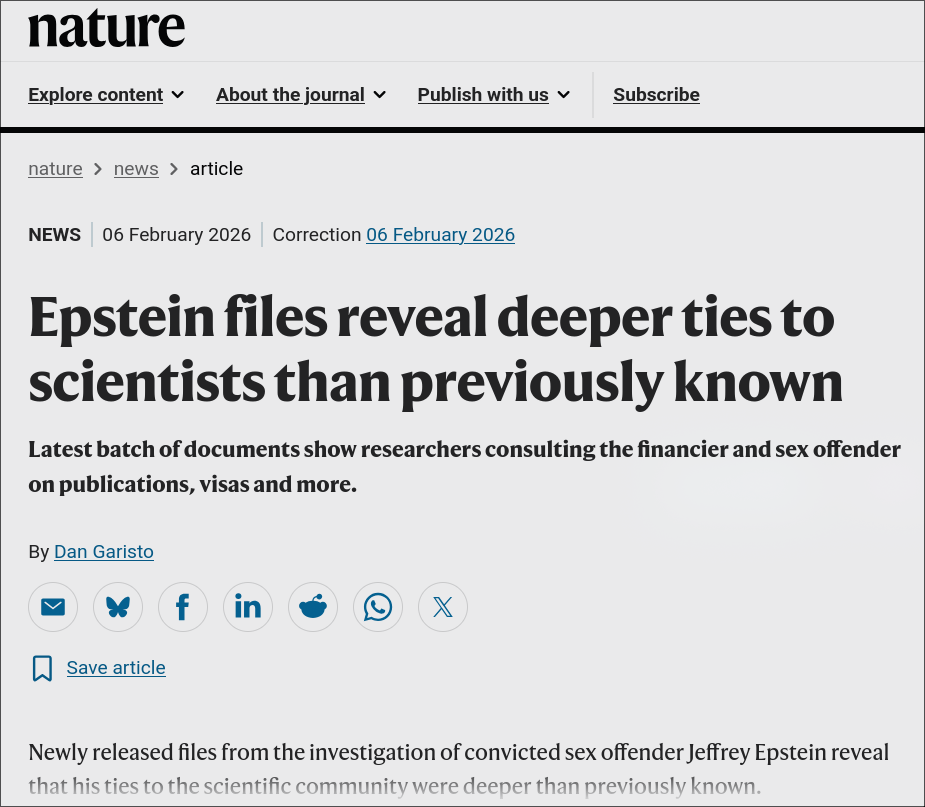{.fragment .emphasize-image .lightbox}
:::

:::

::: {.credit}
Fuentes: Wilson, New Lines magazine [(2026)](https://newlinesmag.com/argument/the-academic-justification-for-male-supremacy/) · Walling, The Outline [(2019)](https://theoutline.com/post/7956/jeffrey-epstein-evolutionary-psychology) · @garistoEpsteinFilesReveal2026
:::

---

## La psicología evolutiva en el centro {auto-animate="true"}

::::{.columns}

:::{.column width="70%"}
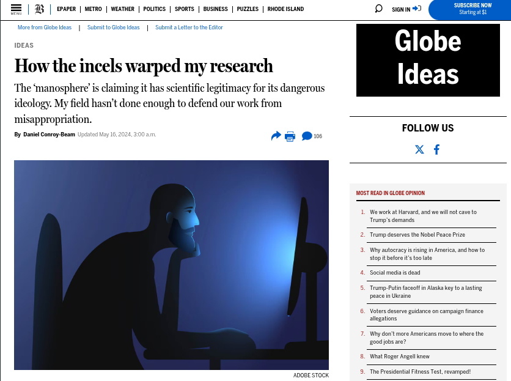{.lightbox}
:::

:::{.column width="30%"}
> [**Cómo los *incels* distorsionaron mi investigación**   La “manosfera” afirma tener legitimidad científica para su peligrosa ideología. Mi campo no ha hecho lo suficiente para defender nuestro trabajo de su uso indebido.]{style="font-size: 50%;"}
:::

::::

::: {.credit}
@conroybeam2024
:::

---

## La psicología evolutiva en el centro {auto-animate="true"}

::::{.columns}

:::{.column width="60%"}
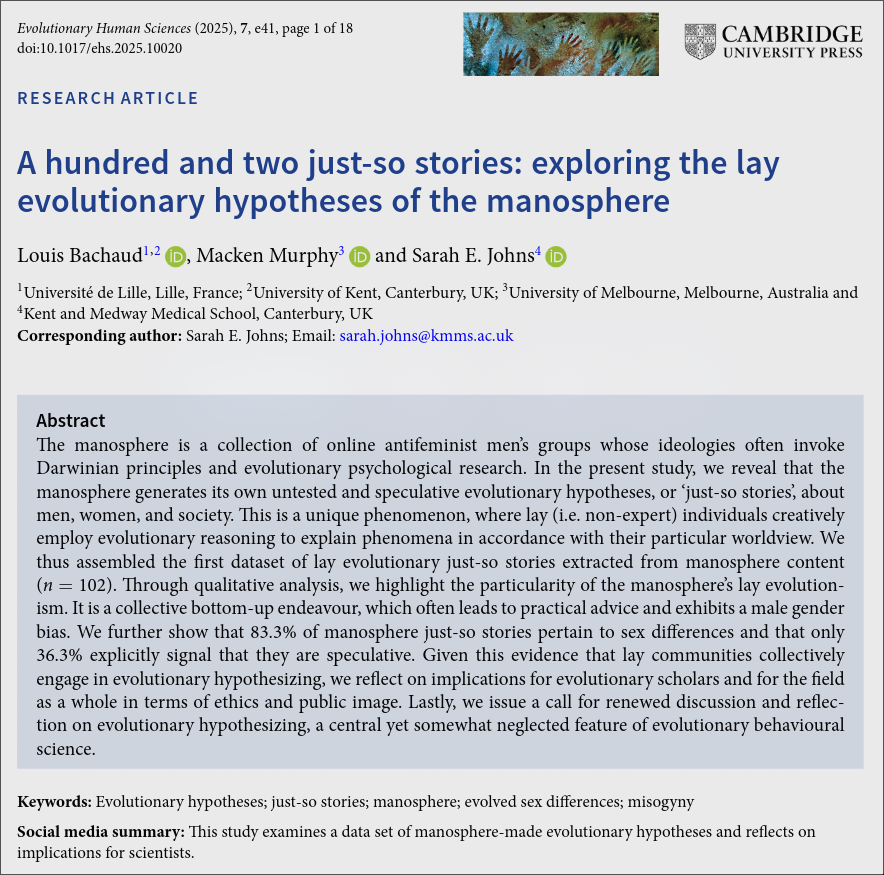{fig-align="center" .lightbox}
:::

:::{.column width="40%"}
> La manósfera no solo usa la psicología evolutiva: crea sus propias
> hipótesis evolutivas no contrastadas ("relatos *ad hoc*") sobre
> hombres, mujeres y sociedad, en un fenómeno de razonamiento
> evolutivo hecho por personas no expertas.
:::

::::

::: {.credit}
@bachaudHundredTwoJustso2025
:::

---

## La grieta {auto-animate="true"}

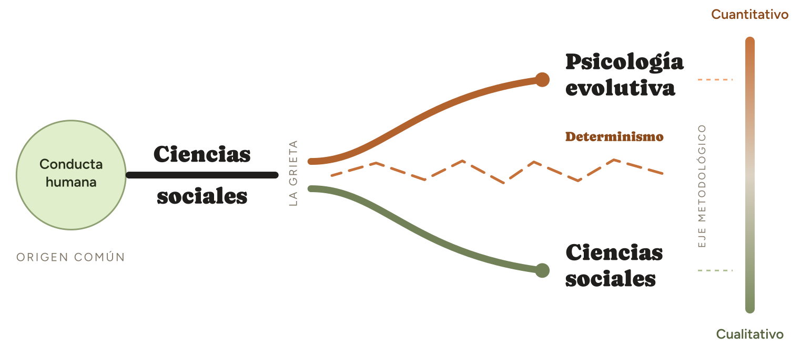{fig-align="center"}

---

## La grieta {auto-animate="true"}

Es una idea falaz

---

## ¿Por qué los hombres son, en promedio, más propensos a la violencia física? {auto-animate="true"}

::: {.center-text}
 
90%

de los sospechosos de homicidio a nivel global son hombres
:::

::: {.credit}
UNODC, Global Study on Homicide [(2023)](https://www.unodc.org/unodc/en/data-and-analysis/global-study-on-homicide.html)
:::

---

## Dos explicaciones, dos niveles {auto-animate="true"}

::: {.columns}

::: {.column width="50%"}
::: {.level-card .social .fragment}
::: {.level-title}
Explicación social
:::
::: {.level-subtitle}
Nivel próximo
:::
::: {.level-tags}
Socialización
Normas de masculinidad
Refuerzo cultural
:::
:::
:::

::: {.column width="50%"}
::: {.level-card .evo .fragment}
::: {.level-title}
Explicación evolutiva
:::
::: {.level-subtitle}
Nivel último
:::
::: {.level-tags}
Competencia por estatus
Historia evolutiva
Riesgo reproductivo
:::
:::
:::

:::

::: {.level-connector .fragment}
Ambas pueden ser ciertas **al mismo tiempo**: responden preguntas distintas
:::

---

## Naturaleza vs. crianza: falso dilema {auto-animate="true"}

::: {.diagram-wrap}
<svg viewBox="0 0 500 140" width="100%" style="max-width:900px;">
<defs>
<linearGradient id="natnur" x1="0%" y1="0%" x2="100%" y2="0%">
<stop offset="0%" stop-color="#333333"/>
<stop offset="49%" stop-color="#333333"/>
<stop offset="49%" stop-color="#F08C00"/>
<stop offset="100%" stop-color="#F08C00"/>
</linearGradient>
</defs>
<rect x="20" y="50" width="460" height="30" rx="15" fill="url(#natnur)"/>
<line x1="245" y1="35" x2="245" y2="95" stroke="#262420" stroke-width="3"/>
<text x="20" y="30" font-size="16" font-weight="700" fill="#333333">Genes</text>
<text x="480" y="30" font-size="16" font-weight="700" fill="#F08C00" text-anchor="end">Ambiente</text>
<text x="245" y="115" font-size="14" text-anchor="middle" fill="#262420">49% / 51%</text>
</svg>
:::

::: {.fragment }
::: {.insight-card .center-text}
Ningún rasgo conductual es 100% genes ni 100% ambiente:\
la heredabilidad promedio es del 49%
:::
:::

::: {.credit}
@polderman2015 · @turkheimer2000
:::

---

## Naturaleza vs. crianza: falso dilema {auto-animate="true"}

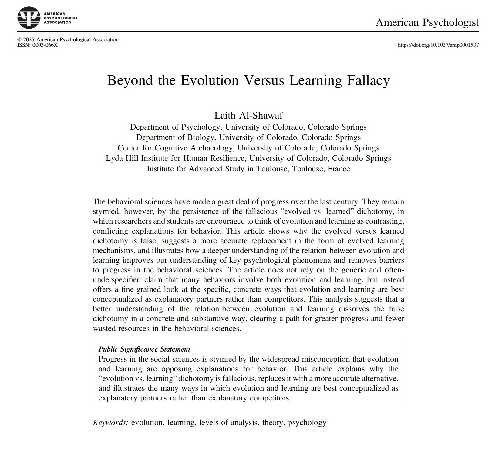{fig-align="center" width="55%" .lightbox}

::: {.credit}
@al-shawafEvolutionLearningFallacy2025
:::

---

## Error 1: Exclusión {auto-animate="true"}

::: {.columns}

::: {.column width="40%"}
::: {.center-text}
**Correcto**
:::

::: {.diagram-wrap}
<svg viewBox="0 0 320 220" width="100%" style="max-width:340px;">
<circle cx="115" cy="110" r="90" fill="rgba(51,51,51,0.15)" stroke="#333333" stroke-width="2"/>
<circle cx="205" cy="110" r="90" fill="rgba(240,140,0,0.15)" stroke="#F08C00" stroke-width="2"/>
<text x="75" y="115" text-anchor="middle" font-size="18" font-weight="700" fill="#262420">Próximo</text>
<text x="245" y="115" text-anchor="middle" font-size="18" font-weight="700" fill="#262420">Último</text>
</svg>
:::
:::

::: {.column width="60%"}
::: {.fragment}
::: {.center-text}
**Error**
:::

::: {.diagram-wrap}
<svg viewBox="0 0 430 240" width="100%" style="max-width:430px;">
<circle cx="100" cy="120" r="90" fill="rgba(51,51,51,0.15)" stroke="#333333" stroke-width="2"/>
<circle cx="320" cy="120" r="90" fill="rgba(240,140,0,0.15)" stroke="#F08C00" stroke-width="2"/>
<text x="100" y="125" text-anchor="middle" font-size="18" font-weight="700" fill="#262420">Próximo</text>
<text x="320" y="125" text-anchor="middle" font-size="18" font-weight="700" fill="#262420">Último</text>
<line x1="197" y1="95" x2="223" y2="145" stroke="#F08C00" stroke-width="6" stroke-linecap="round"/>
<line x1="223" y1="95" x2="197" y2="145" stroke="#F08C00" stroke-width="6" stroke-linecap="round"/>
</svg>
:::
:::
:::

:::

::: {.fragment}
::: {.insight-card .center-text}
Tratar las dos explicaciones como rivales en vez de complementarias.\
Esto  ha alejado a la psicología evolutiva de otras ciencias sociales.
:::
:::

---

## Error 2: Falacia naturalista {auto-animate="true"}

::: {.columns}

::: {.column width="48%"}
::: {.fallacy-card .fragment}
::: {.fallacy-label}
Versión 1
:::
::: {.fallacy-equation}
Explicar ≠ Defender
:::
::: {.fallacy-desc}
Estudiar un fenómeno y explicarlo [no es justificarlo]{.highlight}
:::
:::
:::

::: {.column width="52%"}
::: {.fallacy-card .fragment}
::: {.fallacy-label}
Versión 2
:::
::: {.fallacy-equation}
Natural ≠ Deber ser
:::
::: {.fallacy-desc}
Que algo tenga una explicación [no lo hace inevitable ni deseable]{.highlight}
:::
:::
:::

:::

::: {.fragment .center-text}
  
Evolución ≠ Destino
:::

# Discursos discriminatorios {background-image="img/charla/fondo.jpg" background-opacity="0.3"}

---

## Racismo {auto-animate="true"}

::: {.columns}
::: {.column width="50%"}
"*Intelligence*" research & Race "*science*"

**Pseudociencia** y culto al IQ

::: {.fragment}
::: {.insight-card}
**Richard Lynn** (1930 - 2023)

* Psicólogo\
* Autoproclamado “racista científico”\
* Citado al menos 174 veces

::: {.credit}
Retraction watch [(2025)](https://retractionwatch.com/2025/11/25/meet-the-researcher-aiming-to-halt-use-of-fundamentally-flawed-database-linking-iq-and-nationality/)
:::

:::
:::

:::

::: {.column width="50%"}
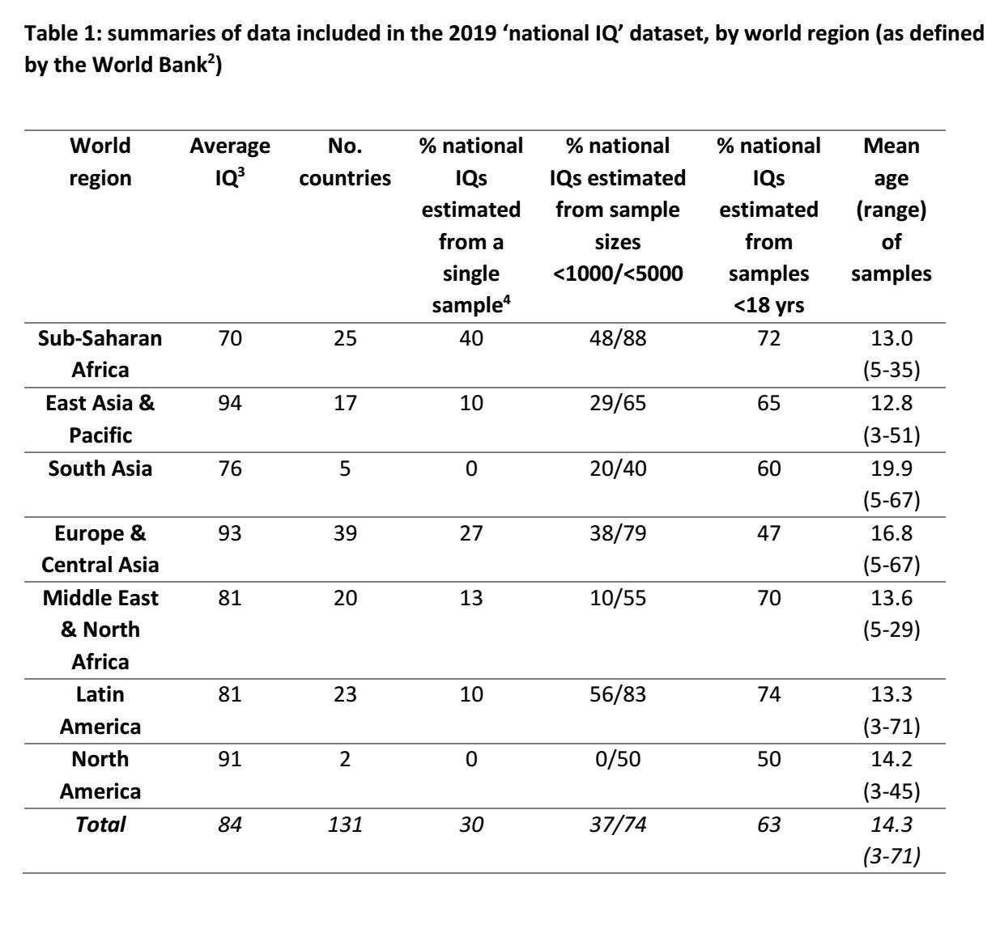{.lightbox}
:::
:::

::: {.credit}
Lynn & Vanhanen (2002) · Lynn & Becker (2019)
:::

---

## Racismo {auto-animate="true" visibility="uncounted"}

::: {.columns}
::: {.column width="30%"}
Rebeca Sear

*Presidenta, [EHBEA](https://www.cambridge.org/core/membership/ehbea)*

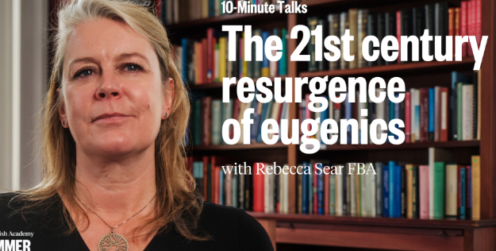
:::

::: {.column width="70%"}
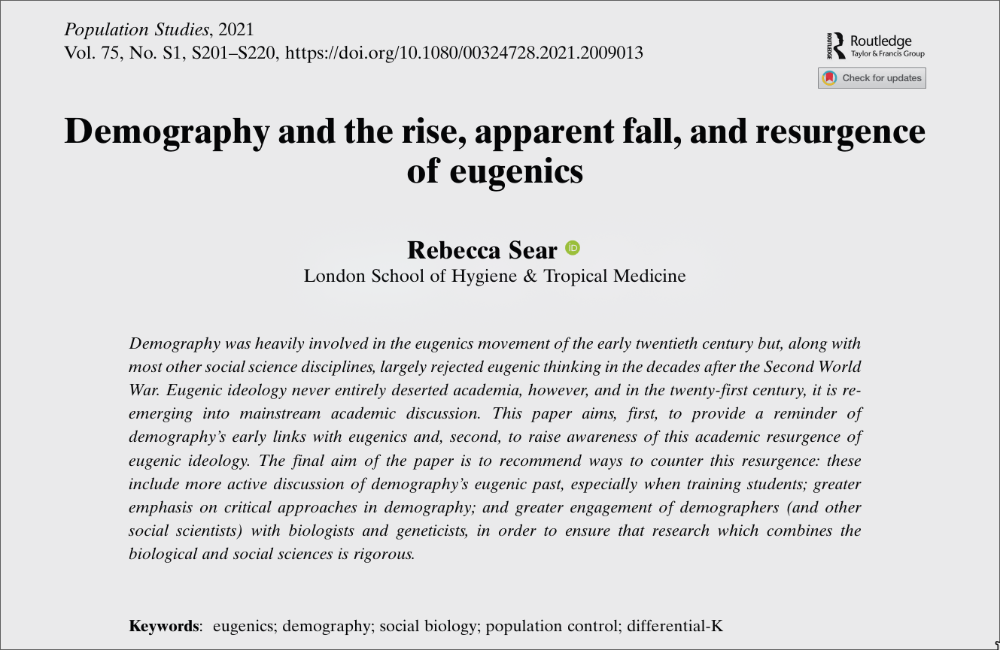{.lightbox}
:::
:::

::: {.credit}
El resurgimiento de la eugenesia: @sear2021eugenics
:::

---

## Racismo {auto-animate="true" visibility="uncounted"}

::: {.columns}
::: {.column width="30%"}
Algún racista de Twitter:
:::

::: {.column width="70%" .center-text}
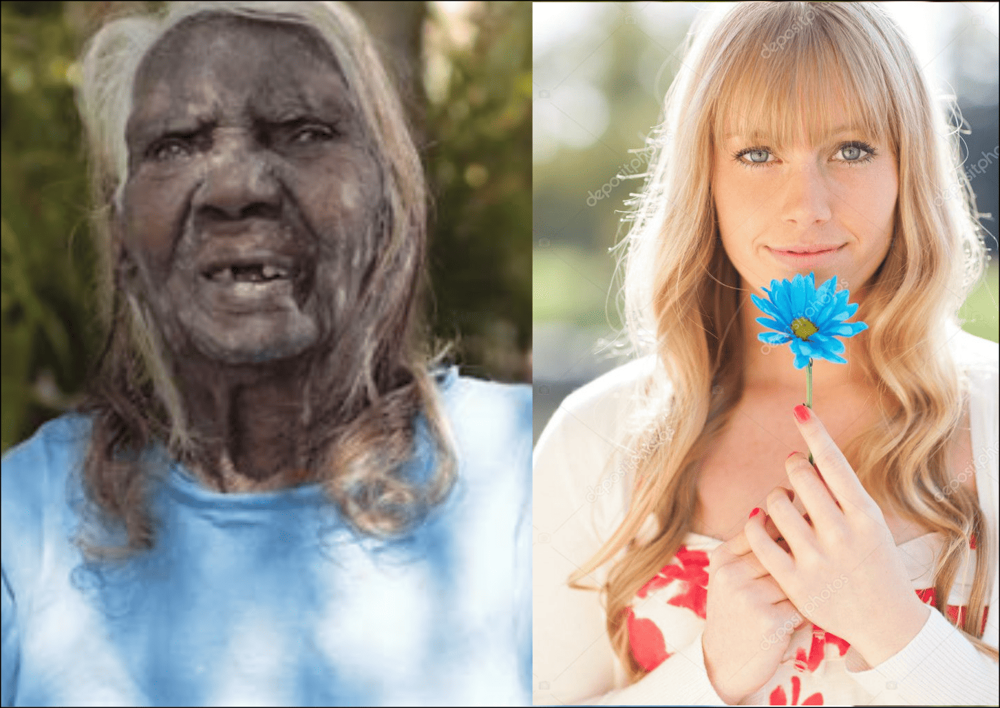{.lightbox}

"*Y dicen que somos la misma especie*"
:::
:::

---

## Racismo {auto-animate="true" visibility="uncounted"}

::: {.columns}
::: {.column width="60%"}
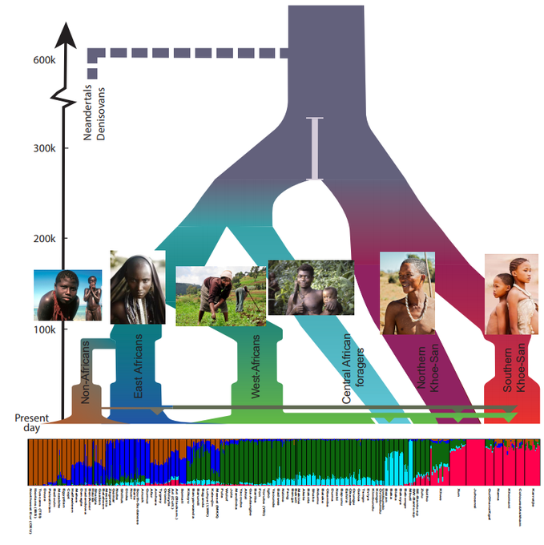{.lightbox}
:::

::: {.column width="40%"}
Diversidad humana

::: {.insight-card}
* La diversidad genética humana es, ante todo, diversidad africana.\
* Todos los no africanos descienden de una sola rama (se separó hace menos de 100.000 años).
:::

:::
:::

---

## Sexismo y culto a la masculinidad {auto-animate="true"}

::: {.columns}
::: {.column width="50%"}

::: {.incremental}
* Énfasis en testosterona y masculinidad
* **Simplificación** en la interpretación
:::

::: {.fragment}
::: {.insight-card}
* Mejor sistema inmune
* Estátus social
* 🚩 Mayor agresividad
* 🚩 Más promiscuidad
* 🚩 Menor inversión parental

::: {.credit}
@archer2006; @dreherTestosteroneCausesBoth2016
:::
:::
:::

:::

::: {.column width="50%"}

:::
:::

---

## Sexismo y culto a la masculinidad {auto-animate="true" visibility="uncounted"}

::: {.columns}
::: {.column width="50%"}
> **Cómo los *incels* distorsionaron mi investigación**
>
> La "manosfera" afirma tener legitimidad científica para su peligrosa ideología.
:::

::: {.column width="50%"}

:::
:::

::: {.credit}
@conroybeam2024
:::

---

## La "familia tradicional" {auto-animate="true"}

::: {.columns}
::: {.column width="30%"}
El mito del hombre proveedor
:::

::: {.column width="70%"}
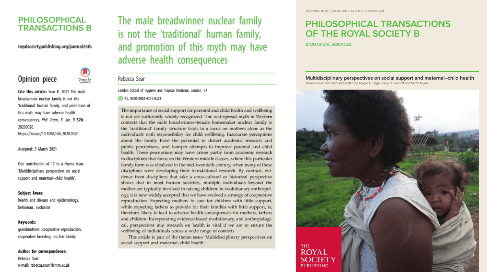{.lightbox}
:::
:::

::: {.credit}
El modelo de hombre proveedor no es la familia humana "tradicional": @sear2021family
:::

---

## Sexo vs. género {auto-animate="true"}

::: {.columns}
::: {.column width="30%"}
Constructos multidimensionales, no binarios
:::

::: {.column width="70%"}
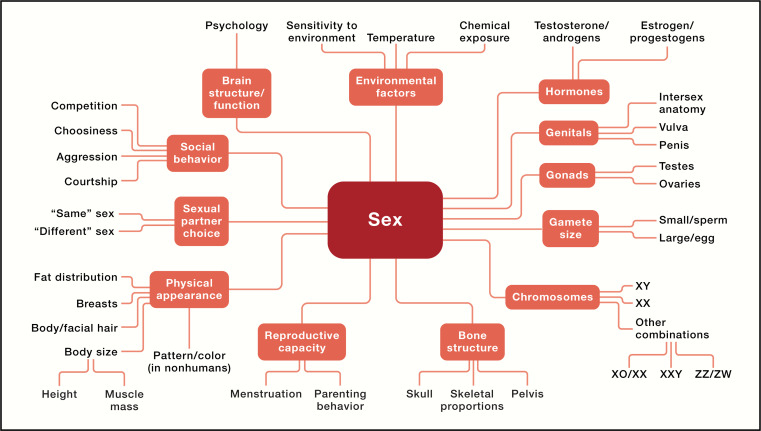
:::
:::

::: {.credit}
Sexo y género: constructos multidimensionales que integran factores biológicos y sociales: @velocciHistorySexResearch2024\
Número especial en Cell ["*Focus on Sex and Gender*"](https://www.cell.com/cell/issue?pii=S0092-8674(23)X0007-5)
:::

---

## Sexo vs. género {auto-animate="true"}

::: {.fragment width="30%"}
[Síndrome de insensibilidad a los andrógenos]{.highlight}
:::

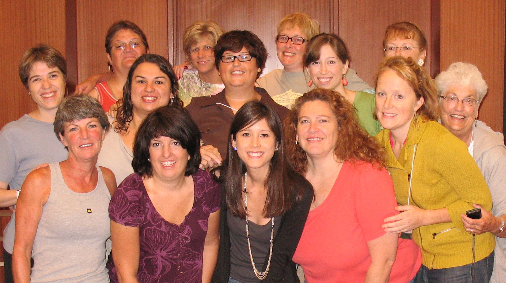{fig-align="center"}

::: {.credit}
@hughesAndrogenResistance2006\
Imágen [Wikipedia](https://es.wikipedia.org/wiki/S%C3%ADndrome_de_insensibilidad_a_los_andr%C3%B3genos)
:::

---

## La integración desmonta el determinismo {auto-animate="true"}

Ninguna disciplina sola explica el comportamiento humano

::: {.fragment}
::: {.insight-card .center-text}
Psicología

::: {.discipline-row .fragment}
::: {.discipline-card}
Biología y Evolución
:::
::: {.discipline-card}
Antropología
:::
::: {.discipline-card}
Sociología
:::
::: {.discipline-card}
Historia
:::
:::

:::
:::

---

## ¿Y qué hacemos? {auto-animate="true"}

::: {.fragment}
¿Cómo tomamos los aportes evolutivos?
:::

::: {.columns}

::: {.column width="50%"}
::: {.fallacy-card .fragment}
::: {.fallacy-label}
Error 1
:::
::: {.fallacy-equation}
Rechazar en bloque
:::
::: {.fallacy-desc}
Ignorar aportes fundamentales de las miradas evolutivas\
Generalizar errores e interpretaciones sesgadas
:::
:::
:::

::: {.column width="50%"}
::: {.fallacy-card .fragment}
::: {.fallacy-label}
Error 2
:::
::: {.fallacy-equation}
Tragar entero
:::
::: {.fallacy-desc}
Aceptar sin crítica cualquier interpretación evolutiva\
(especialmente de redes)
:::
:::
:::

:::

::: {.fragment}
::: {.insight-card .center-text}
Mirada crítica
:::
:::

---

## ¡Gracias! {background-image="img/charla/fondo.jpg" background-size="cover" background-opacity="0.1"}

::::: columns

::: {.column width="40%"}
[**Juan David Leongómez**]{style="font-size: 140%;"} [PhD, MSc]{style="font-size: 70%;"} 
[jleongomez\@unbosque.edu.co](mailto:jleongomez@unbosque.edu.co){style="font-size: 90%;"}  
[{width="80%"}](https://jdleongomez.info/es/)
:::

::: {.column width="60%"}
[**Referencias**]{style="color: #4B5563;"}

::: {#refs style="font-size: 70%; line-height: 1.3; columns: 1; color: #4B5563;"}
:::
:::

:::::
